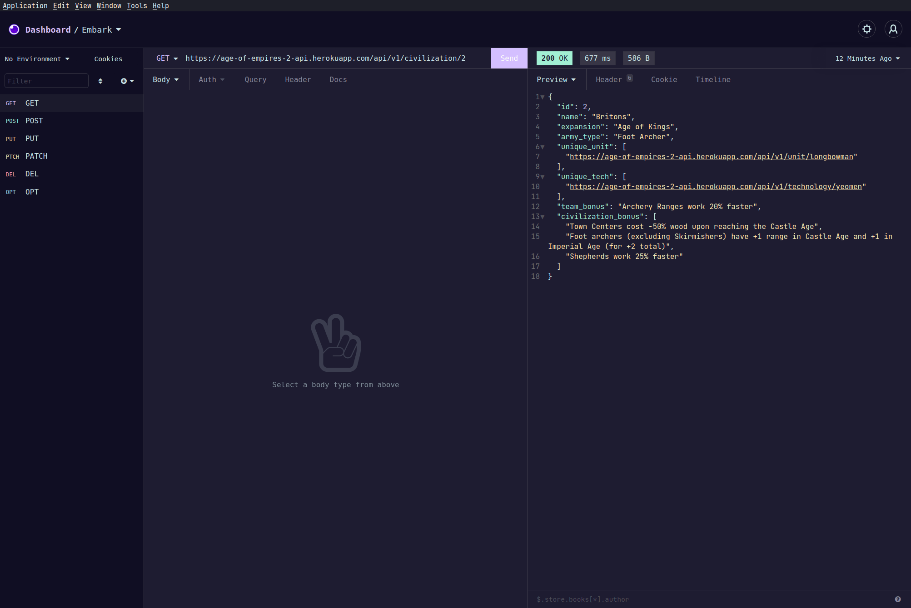

# Insomnia

A dark theme for [Insomnia](http://insomnia.rest).
Embark Theme colors can be found [here](https://embark-theme.github.io).

## Install
1. Navigate to *Application* and select *Preferences* 
2. Click on *Plugins*
3. In the *Install plugin* field, enter `insomnia-plugin-embark-theme`
4. Click *Install plugin*
5. Navigate to Preferences > Themes and you should see the Embark Theme available.

## Activating the theme
1. Got to *Application* and select *Preferences*
2. click on *Themes*
3. Select **Embark** to apply the theme

## License

[MIT License](./LICENSE)
